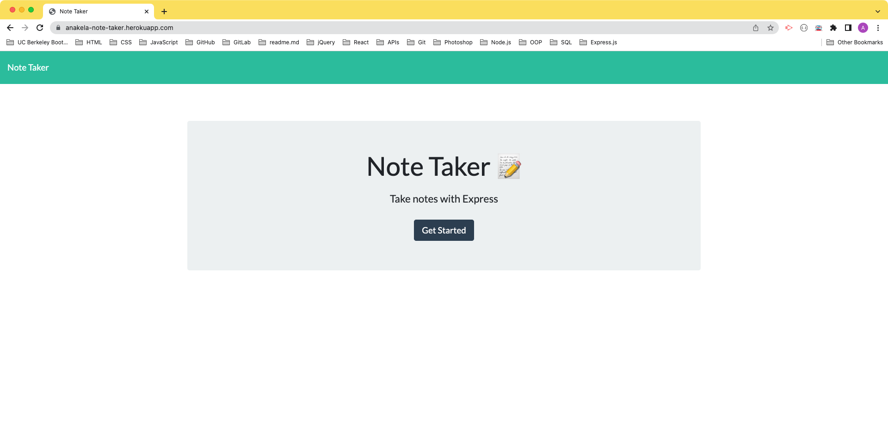
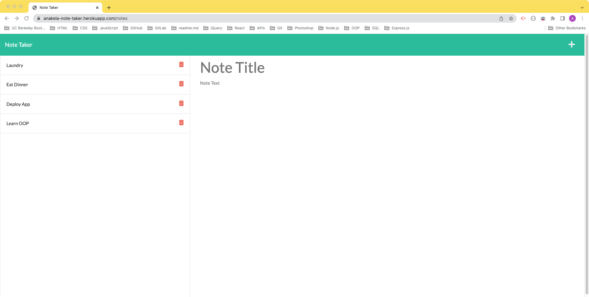

# Challenge 11 - Note Taker

## Table of Contents

- [Overview](#overview)
  - [The Challenge](#the-challenge)
  - [User Story](#user-story)
  - [Acceptance Criteria](#acceptance-criteria)
  - [Screenshot](#screenshot)
  - [Links](#links)
- [My Process](#my-process)
  - [Built With](#built-with)
  - [What I Learned](#what-i-learned)
  - [Continued Development](#continued-development)
  - [Useful Resources](#useful-resources)
- [Author](#author)
- [Acknowledgments](#acknowledgments)

## Overview

### The Challenge

Your assignment is to modify starter code to create an application called Note Taker that can be used to write and save notes. This application will use an Express.js back end and will save and retrieve note data from a JSON file.

The application’s front end has already been created. It's your job to build the back end, connect the two, and then deploy the entire application to Heroku.

### User Story

```md
AS A small business owner
I WANT to be able to write and save notes
SO THAT I can organize my thoughts and keep track of tasks I need to complete
```

### Acceptance Criteria

```md
GIVEN a note-taking application
WHEN I open the Note Taker
THEN I am presented with a landing page with a link to a notes page
WHEN I click on the link to the notes page
THEN I am presented with a page with existing notes listed in the left-hand column, plus empty fields to enter a new note title and the note’s text in the right-hand column
WHEN I enter a new note title and the note’s text
THEN a Save icon appears in the navigation at the top of the page
WHEN I click on the Save icon
THEN the new note I have entered is saved and appears in the left-hand column with the other existing notes
WHEN I click on an existing note in the list in the left-hand column
THEN that note appears in the right-hand column
WHEN I click on the Write icon in the navigation at the top of the page
THEN I am presented with empty fields to enter a new note title and the note’s text in the right-hand column
```

### Screenshot




### Links

- GitHub Repository: [https://github.com/anakela/note-taker](https://github.com/anakela/note-taker)
- Live Site URL: [https://anakela-note-taker.herokuapp.com/](https://anakela-note-taker.herokuapp.com/)

## My Process

### Built With

- Semantic HTML5 markup
- CSS
- JavaScript
- Node.js
- Express.js

### What I Learned

I learned several things while working on this assignment.
- First, this challenge was my first opportunity to combine `Node.js` and frontend development together.  Before working on the note taker, I was in the dark about associating frontend GUI with backend code using `Node.js`.
- Second, it was also provided a chance to explore how to use Express.js and routes.  I discovered that using routes allowed me to prepend directory path elements to extended directory paths.  For example, in my `routes > index.js` file, I appended `'/api'` to all `apiRoutes > index.js` files.

```JavaScript
const router = require('express').Router();
const apiRoutes = require('./apiRoutes');

// Prepend '/api' to every route declared in apiRoutes.
router.use('/api', apiRoutes);

module.exports = router;
```

- Thirdly, I learned how to use NPM's `uuid` to generate IDs for each object in my `db.json` database.  This came in especially handy for when I, and subsequently users, needed to delete a note.

```JavaScript
router.post('/notes', (req, res) => {
    console.log(req.body);
    const noteObj = {
        // Here, each ID is generated automatically by uuid.
        id: uuidv4(),
        title: req.body.title,
        text: req.body.text
    };
    readFile('./db/db.json', 'utf-8')
        .then((response) => {
            let data = JSON.parse(response);
            // console.log(data);
            // res.json(data);
            data.push(noteObj);
            
            writeFile('./db/db.json', JSON.stringify(data))
                .then((result) => {
                    console.log(result);
                    res.json(data);
                });
        });

});
```

```JavaScript
const { v4: uuidv4 } = require('uuid');

router.delete('/notes/:id', (req, res) => {
    // Here, use each node's ID to determine which should be deleted.
    console.log(req.params.id);
    readFile('./db/db.json', 'utf-8')
        .then((response) => {
            let data = JSON.parse(response);
            // Filter out all note IDs that don't match the ID that the user selected.
            const filteredNotes = data.filter(note => note.id !== req.params.id);
            console.log(filteredNotes);

            writeFile('./db/db.json', JSON.stringify(filteredNotes))
                .then((result) => {
                    console.log(result);
                    res.json(filteredNotes);
                });
        });
});
```

### Continued Development

In the future, I would like to update this app so that notes can be edited.  I would most likely do this by adding code similar to the following:

```JavaScript
router.patch('/notes/:id', (req, res) => {
    console.log(req.params.id);
    readFile('./db/db.json', 'utf-8')
        .then((response) => {
            let data = JSON.parse(response);
            const filteredNotes = data.filter(note => note.id !== req.params.id);
            console.log(filteredNotes);

            writeFile('./db/db.json', JSON.stringify(filteredNotes))
                .then((result) => {
                    console.log(result);
                    res.json(filteredNotes);
                });
        });
});
```

I would then need to update the `public > js > index.js` file to add icons to each note, which users could click in order to edit them individually.  I would then add a save icon so that each note could be displayed and then saved/updated.

### Useful Resources

- [Code Grepper: “how to add .ds_store to gitignore” Code Answer’s](https://www.codegrepper.com/code-examples/whatever/how+to+add+.ds_store+to+gitignore)
- [Heroku Dev Center: Deploying Node.js Apps on Heroku](https://devcenter.heroku.com/articles/deploying-nodejs)
- [MDN Web Docs: Array.prototype.filter()](https://developer.mozilla.org/en-US/docs/Web/JavaScript/Reference/Global_Objects/Array/filter)
- [NPM: uuid](https://www.npmjs.com/package/uuid)
- [Postman](https://web.postman.co/workspace/My-Workspace~b001dcd3-ee8f-4a22-8b58-6a2474c2cdc3/request/create?requestId=1694d1ed-d0f6-41b2-80fd-5003e5476f5c)

## Author

- GitHub - [https://github.com/anakela](https://github.com/anakela)
- LinkedIn - [https://www.linkedin.com/in/anakela/](https://www.linkedin.com/in/anakela/)

## Acknowledgments

- Fellow Bootcampers
  - Ivy Chang
  - Nolan Spence
- TAs
  - Scott Nelson
  - Luigi Campbell
  - Matthew Kaus